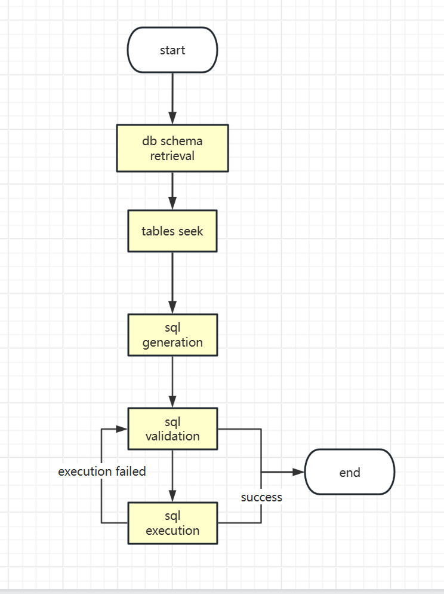

# NLToSQL - Natural Language to SQL Query Tool

NLToSQL is a tool that converts natural language into SQL query statements, designed to help non-technical users interact with databases through natural language and lower the barrier to database querying.

## Project Overview

This project is based on natural language processing technology that can understand natural language queries input by users and convert them into accurate SQL query statements. It is suitable for user groups who need to query databases frequently but are not familiar with SQL syntax.

## Features

- 🗣️ **Natural Language Input**: Supports natural language queries in various languages
- 🔄 **Intelligent Conversion**: Automatically converts natural language to standard SQL statements based on context
- 📊 **Multi-database Support**: Compatible with mainstream database systems
- 🛠️ **Easy Integration**: Provides API interfaces for easy integration into existing systems
- 🎯 **High Accuracy**: Based on deep learning models to provide accurate query conversion

## Technical Architecture

- Natural Language Processing Engine
- Semantic Parsing Module
- SQL Syntax Generator
- Database Adapter


## Technical Details
- **Programming Language**: Python
- **Database Adapter**: Supports MySQL, PostgreSQL, Oracle, SQL Server, and more
- **Semantic Parsing**: Based on deep learning models to understand natural language queries and generate semantic representations
- **SQL Syntax Generator**: Based on deep learning models to generate SQL syntax based on semantic representations
- **API Interface**: Provides RESTful API for easy integration into existing systems
- **User Interface**: web ui for testing and demonstration
- **Deployment**: Docker is used for easy deployment, autoDL is used for model private deployment
- **Testing**: Unit tests and integration tests are provided to ensure the correctness of the system

## Installation and Usage

### Requirements

- Python 3.7+
- Related dependencies (see requirements.txt for details)

### Installation

```
bash
# Clone the project
git clone <project-url>

# Enter project directory
cd nltosql

# Install dependencies
pip install -r requirements.txt
```
### Basic Usage

```
python
# Example code
from nltosql import NLToSQL

converter = NLToSQL()
sql_query = converter.convert("Query customers with sales exceeding 1 million in 2023")
print(sql_query)
```
## Usage Examples

| Natural Language Query | Generated SQL |
|-----------------------|---------------|
| Query all user information | `SELECT * FROM users` |
| Query users registered in 2023 | `SELECT * FROM users WHERE register_date >= '2023-01-01' AND register_date <= '2023-12-31'` |

## Configuration

Project configuration files are located in the `config/` directory and can be adjusted according to specific database structure.

## Contributing

Issues and Pull Requests are welcome to help improve the project.

## License

This project is licensed under the MIT License. See the LICENSE file for details.

## Contact

If you have any questions, please contact the project maintainers or submit an Issue.
```
